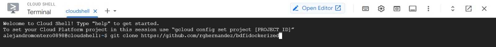
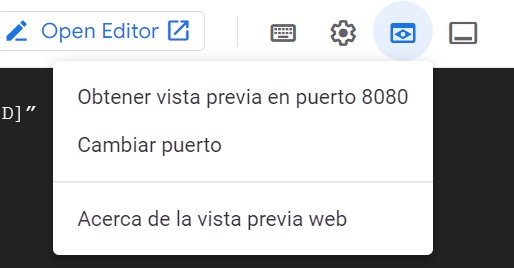
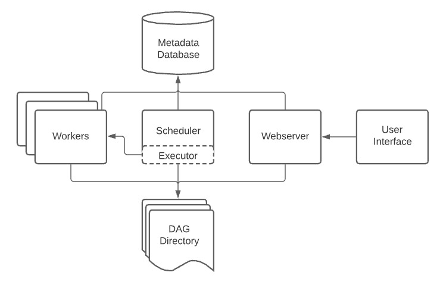

# Agile_Data_Code_2
## Autores
- Roberto García Hernández
- Alejandro Montero Medialdea

## Introducción
El presente proyecto de la asignatura BDFI en el curso 2022-2023 tiene como finalidad implementar un sistema de predicción de retrasos de vuelos. Dicho sistema estará compuesto por una serie de componentes que se encargarán de predecir analíticamente y en tiempo real una serie de trazas para poder mostrarnos el retraso resultante. Para ello la arquitectura de nuestro sistema será la mostrada a continuación.

[](http://datasyndrome.com/video)

### Front End 
El usuario accederá a la URL donde se le presentarán los cuadros con la información relacionada con la predicción de los retrasos y formularios a rellenar. Una vez rellenado este formulario la información será enviada a la cola de mensajería en tiempo real Kafka, bajo un tópico, al servidor, donde se llevarán a cabo las labores del back-end. El último paso será el envío de esta información desde la base de datos de nuevo hacia el frontal para poder presentarla.


### Back End
Este se centrará en Spark, donde se entrenará un modelo con los datos recogidos del frontal para poder realizar las predicciones. Spark estará suscrito al tópico de Kafka para la predicción de retrasos, por lo que escuchará la cola, procesará la información del frontal y la almacenará en una base de datos Mongo.


# Proceso
A continuación, se detallará más en profundad como deberá funcionar el sistema completo:
1. Se descargarán los datos relacionados con los vuelos. Estos se encuentran en un dataset que recogerá la información suficiente como par poder predecir los retrasos y entrenar el modelo. 
2. Entrenar modelo de Machine Learning utilizando el dataset.
3. Desplegar el job de Spark que predice el retraso de los vuelos usando el modelo creado
4. Introducción de los datos del vuelo a predecir en el frontal web y su posterior envio al servidor web de Flask por medio de la cola de mensajería Kafka especificando el tópico.
5. Entrenar el modelo predictivo empleando el algoritmo RandomForest con los datos obtenidos.
6. El job de Spark en el servidor realizará la predicción de los retrasos de los vuelos por medio de los datos del tópico al que se encuentra suscrito de Kafka.
7. La ejecución del job se realizará por medio del fichero jar para Scala generado por medio de spark-submit.
8. Guardar las diversas predicciones en la base de datos de Mongo.
9. Por medio del polling que flask realizará sobre Mongo se podrá consultar los resultados de la predicción y mostrarlos en el frontal.

# Herramientas utilizadas
- [Intellij](https://www.jetbrains.com/help/idea/installation-guide.html) (jdk_1.8)
- [Pyhton3](https://realpython.com/installing-python/) (versión 3.8)
- [PIP](https://pip.pypa.io/en/stable/installing/)
- [SBT](https://www.scala-sbt.org/release/docs/Setup.html) 
- [MongoDB](https://docs.mongodb.com/manual/installation/) (versión 4.4)
- [Spark](https://spark.apache.org/docs/latest/) (versión 3.1.2)
- [Scala](https://www.scala-lang.org) (versión 2.12)
- [Zookeeper](https://zookeeper.apache.org/releases.html) (versión 3.7.1)
- [Kafka](https://kafka.apache.org/quickstart) (versión 2.12-3.0.0)
- [Flask](https://flask.palletsprojects.com/en/2.2.x/)
- [Docker](https://www.docker.com/)
- [Google-Cloud](https://cloud.google.com/)
- [AirFlow](https://airflow.apache.org/docs/apache-airflow/stable/start.html)

# Hitos realizados
* *(4 puntos)* Lograr el funcionamiento de la práctica sin realizar modificaciones
*	*(1 punto)* Ejecución del job de predicción con Spark Submit en vez de IntelliJ
*	*(1 punto)* Dockerizar cada uno de los servicios que componen la arquitectura completa
*	*(1 punto)* Desplegar el escenario completo usando docker-compose
*	*(1 punto)* Desplegar el escenario completo en Google Cloud
*	*(2 puntos)* Entrenar el modelo con Apache Airflow


## Instrucciones de despliegue

## Despliegue con Docker 
Para el despliegue de la aplicación con docker compose iniciamos un terminal y ejecutamos:

```
git clone https://github.com/rghernandez/bdfidockerized
cd bdfidockerized
docker compose up
```
Esto levantará la aplicación web en http://localhost:5000/flights/delays/predict_kafka y spark en http://localhost:8080.

Si esto lo queremos abrir desde Google Cloud, abririamos una shell y ejecutariamos los mismos comandos. A continuación, para visualizar las interfaces web realizariamos el proceso que se ve en las siguientes imágenes:





Esto nos abrirá una nueva pestaña en nuestro navegador con una url similar a: https://5000-cs-aa20e686-8a23-4990-92b7-421de53d38c5.cs-europe-west1-xedi.cloudshell.dev/?authuser=0&redirectedPreviously=true

## Despliegue en local

Nos descargamos el proyecto desde el github y accedemos a él:
```
git clone https://github.com/ging/practica_big_data_2019
cd practica_big_data_2019
```
A continuación, descargamos el dataset.

```
resources/download_data.sh
```

 
 ### Instalar las librerías de Python
 
 ```
  pip install -r requirements.txt
 ```
 ### Iniciar Zookeeper
 
 Abrir la consola, acceder al directorio de Kafka y ejecutar:
 
 ```
   bin/zookeeper-server-start.sh config/zookeeper.properties
  ```
  ### Iniciar Kafka
  
  Abrir la consola, acceder al directorio de Kafka y ejecutar:
  
  ```
    bin/kafka-server-start.sh config/server.properties
   ```
  Abrir una nueva consola en el mismo directorio y crear el tópic:
  ```
      bin/kafka-topics.sh \
        --create \
        --bootstrap-server localhost:9092 \
        --replication-factor 1 \
        --partitions 1 \
        --topic flight_delay_classification_request
   ```
  Se observará el siguiente mensaje:
  ```
    Created topic "flight_delay_classification_request".
  ```
  Con el siguiente comando podrás observar el tópico creado:
  ```
      bin/kafka-topics.sh --bootstrap-server localhost:9092 --list
  ```
  Salida:
  ```
    flight_delay_classification_request
  ```
 (Opcional) Puedes abrir una nueva consola con un consumidor para poder observar los mensajes enviados a un tópico
  ```
  bin/kafka-console-consumer.sh \
      --bootstrap-server localhost:9092 \
      --topic flight_delay_classification_request \
      --from-beginning
  ```
  ### Importar los registros de distancias en MongoDB
  
 Comprobar que Mongo esté levantado y corriendo:
  ```
  service mongod status
  ```
  
 Salida:
 
  ```
  mongod.service - MongoDB Database Server
     Loaded: loaded (/lib/systemd/system/mongod.service; disabled; vendor preset: 
     Active: active (running) since Tue 2019-10-01 14:58:53 CEST; 2h 11min ago
       Docs: https://docs.mongodb.org/manual
   Main PID: 7816 (mongod)
     CGroup: /system.slice/mongod.service
             └─7816 /usr/bin/mongod --config /etc/mongod.conf
  
  oct 01 14:58:53 amunoz systemd[1]: Started MongoDB Database Server.
  ```
  Correr el script import_distances.sh
  ```
  ./resources/import_distances.sh
  ```
  Salida:

  ```
  2019-10-01T17:06:46.957+0200	connected to: mongodb://localhost/
  2019-10-01T17:06:47.035+0200	4696 document(s) imported successfully. 0 document(s) failed to import.
  MongoDB shell version v4.2.0
  connecting to: mongodb://127.0.0.1:27017/agile_data_science?compressors=disabled&gssapiServiceName=mongodb
  Implicit session: session { "id" : UUID("9bda4bb6-5727-4e91-8855-71db2b818232") }
  MongoDB server version: 4.2.0
  {
  	"createdCollectionAutomatically" : false,
  	"numIndexesBefore" : 1,
  	"numIndexesAfter" : 2,
  	"ok" : 1
  }

  ```
  ### Entrenar y guardar el modelo con PySpark mllib
  Acceder al directorio del repositorio clonado y acceder a `practica_big_data_2019`
  ```
    cd practica_big_data_2019
  ```
 Generar la variable de entorno `JAVA_HOME`:
  ```
    export JAVA_HOME=/usr/lib/jvm/java-1.8.0-openjdk-amd64
  ```
 Generar la variable de entorno  `SPARK_HOME`:
  ```
    export SPARK_HOME=/opt/spark
  ```
  Ejecutar el script `train_spark_mllib_model.py`
  ```
      python3 resources/train_spark_mllib_model.py .
  ```
 Como resultado algunos ficheros se guardarán en la carpeta `models`: 
  
  ```
  ls ../models
  
  ```   
  ### Ejecutar la Predicción de Vuelos
  En primer lugar, es necesario modificar la variable base_path en el MakePrediction de la clase de Scala:
  ```
    val base_path= "/home/user/Desktop/practica_big_data_2019"
    
  ``` 
 Correr el código utilizando Intellij o spark-submit con sus respectivos argumentos. 
 Generamos el jar para la ejecución con spark-submit:
```
sbt package 
```
 Y ejecutamos la predicción de vuelos con spark-submit.
  ```
 spark-submit --class es.upm.dit.ging.predictor.MakePrediction --packages org.mongodb.spark:mongo-spark-connector_2.12:3.0.1,org.apache.spark:spark-sql-kafka-0-10_2.12:3.0.0 /practica_big_data_2019/flight_prediction/target/scala-2.12/flight_prediction_2.12-0.1.jar
     
  ``` 
  
  ### Iniciar la aplicación web para las peticiones de predicción
  
 Configurar la variable de entorno  `PROJECT_HOME`:
   ```
  export PROJECT_HOME=/home/user/Desktop/practica_big_data_2019
   ```
 Ir a la carpeta `web` dentro de `resources` and ejecuta el fichero con la aplicación web `predict_flask.py`:
  ```
  cd practica_big_data_2019/resources/web
  python3 predict_flask.py
  
  ```
 Visitar a continuación  http://localhost:5000/flights/delays/predict_kafka y abrir la consola JavaScript para visualizar el tráfico. Añadir un delay distinto de cero en la salida con el formato ISO-formatted date (2016-12-25), un código válido (AA o DL), un origen y destino, un número válido de vuelo (1519 por ejemplo) y pulsar en Submit. Observar el debug desde la consola para obtener más información.
  
  ### Observar los registros de las predicciones insertados en MongoDB
  ```
   $ mongo
   > use use agile_data_science;
   >db.flight_delay_classification_response.find();
  
  ```
  Deberá observar una salida como:
  
  ```
  { "_id" : ObjectId("5d8dcb105e8b5622696d6f2e"), "Origin" : "ATL", "DayOfWeek" : 6, "DayOfYear" : 360, "DayOfMonth" : 25, "Dest" : "SFO", "DepDelay" : 290, "Timestamp" : ISODate("2019-09-27T08:40:48.175Z"), "FlightDate" : ISODate("2016-12-24T23:00:00Z"), "Carrier" : "AA", "UUID" : "8e90da7e-63f5-45f9-8f3d-7d948120e5a2", "Distance" : 2139, "Route" : "ATL-SFO", "Prediction" : 3 }
  { "_id" : ObjectId("5d8dcba85e8b562d1d0f9cb8"), "Origin" : "ATL", "DayOfWeek" : 6, "DayOfYear" : 360, "DayOfMonth" : 25, "Dest" : "SFO", "DepDelay" : 291, "Timestamp" : ISODate("2019-09-27T08:43:20.222Z"), "FlightDate" : ISODate("2016-12-24T23:00:00Z"), "Carrier" : "AA", "UUID" : "d3e44ea5-d42c-4874-b5f7-e8a62b006176", "Distance" : 2139, "Route" : "ATL-SFO", "Prediction" : 3 }
  { "_id" : ObjectId("5d8dcbe05e8b562d1d0f9cba"), "Origin" : "ATL", "DayOfWeek" : 6, "DayOfYear" : 360, "DayOfMonth" : 25, "Dest" : "SFO", "DepDelay" : 5, "Timestamp" : ISODate("2019-09-27T08:44:16.432Z"), "FlightDate" : ISODate("2016-12-24T23:00:00Z"), "Carrier" : "AA", "UUID" : "a153dfb1-172d-4232-819c-8f3687af8600", "Distance" : 2139, "Route" : "ATL-SFO", "Prediction" : 1 }


```

### Entrenar el modelo con Apache Airflow (optional)

- Instalar las depencias de Apache Airflow:

```
cd resources/airflow
pip install -r requirements.txt -c constraints.txt
```
- Establecemos la variable de entorno `PROJECT_HOME` :
```
export PROJECT_HOME=/home/user/Desktop/practica_big_data_2019
```
- Configuramos el entorno de Airflow:

```
export AIRFLOW_HOME=~/airflow
mkdir $AIRFLOW_HOME/dags
mkdir $AIRFLOW_HOME/logs
mkdir $AIRFLOW_HOME/plugins
```
- Copiamos el DAG definido en `setup.py` en la carpeta dags que acabamos de crear:

```
cp setup.py $AIRFLOW_HOME/dags
```

- Iniciamos la base de datos de Airflow: 
```
airflow db init

airflow users create \
    --username admin \
    --firstname Jack \
    --lastname  Sparrow\
    --role Admin \
    --email example@mail.org
    --pass pass
```
- Iniciamos el scheduler y el webserver:

```
airflow webserver --port 9090
airflow sheduler
```
- Visitamos http://localhost:9090/home para la ver la versión web de Apache Airflow. Si queremos ejecutar a través de la linea de comandos un DAG, por ejemplo, el que acabamos de crear ejecutariamos los siguientes comandos:

```
airflow dags unpause agile_data_science_batch_prediction_model_training
airflow dags trigger agile_data_science_batch_prediction_model_training
```

### Arquitectura de airflow
La arquitectura de Airflow se compone de 

- Scheduler: Se encarga de hacer la programación de los DAGS, asi como de cargarlos en el Executor.  
- Metadata Database: Base de datos que almacena el estado.
- Executor: Se encarga de administrar las tareas que están en ejecución siendo ejecutadas por los workers.
- Webserver: Es la interfaz que permite al usuario activar e inspeccionar los DAGs. Pudiendo ver en esta interfaz, por ejemplo, el estado de los DAGS.
- Directorio DAG: Directorio desde el cual se cargan los nuevos DAGS para su ejecución.



### Análisis Setup.py 

Se añade a continuación el archivo setup.py con comentarios correspondientes a la funcionalidad de cada parte:

```python
import sys, os, re

from airflow import DAG
from airflow.operators.bash import BashOperator

from datetime import datetime, timedelta
import iso8601

PROJECT_HOME = os.getenv("PROJECT_HOME")


# Con las siguientes propiedades definimos el numero de intentos que debe 
# realizar antes de que el DAG no se ejecute y muera con la propiedad retries. 
# Ademas, con retry_delay definimos cada cuanto tiempo realizamos estos reintentos.
default_args = {
  'owner': 'airflow',
  'depends_on_past': False,
  'start_date': iso8601.parse_date("2016-12-01"),
  'retries': 3,
  'retry_delay': timedelta(minutes=5),
}

# A continuación se configura el DAG con las propiedades definidas anteriormente
# y el nombre de este DAG. También se le asigna un schedule_interval para definir 
# cada cuanto tiempo se debe realizar este DAG. Otros valores de este campo pueden ser
# @once @hourly @daily
training_dag = DAG(
  'agile_data_science_batch_prediction_model_training',
  default_args=default_args,
  schedule_interval=None
)

# We use the same two commands for all our PySpark tasks
pyspark_bash_command = """
/opt/spark/bin/spark-submit --master {{ params.master }} \
  {{ params.base_path }}{{ params.filename }} \
  {{ params.base_path }}
"""
pyspark_date_bash_command = """
/opt/spark/bin/spark-submit --master {{ params.master }} \
  {{ params.base_path }}{{ params.filename }} \
  {{ ts }} {{ params.base_path }}
"""


# Gather the training data for our classifier
"""
extract_features_operator = BashOperator(
  task_id = "pyspark_extract_features",
  bash_command = pyspark_bash_command,
  params = {
    "master": "local[8]",
    "filename": "resources/extract_features.py",
    "base_path": "{}/".format(PROJECT_HOME)
  },
  dag=training_dag
)

"""

# En esta parte de define el BashOperator para saber que tarea se va a ejecutar 
# en el DAG. Se define la dirección del master de Spark, el archivo de entrenamiento 
# y la direccioón del proyecto

# Train and persist the classifier model
train_classifier_model_operator = BashOperator(
  task_id = "pyspark_train_classifier_model",
  bash_command = pyspark_bash_command,
  params = {
    "master": "local[8]",
    "filename": "resources/train_spark_mllib_model.py",
    "base_path": "{}/".format(PROJECT_HOME)
  },
  dag=training_dag
)

# The model training depends on the feature extraction
#train_classifier_model_operator.set_upstream(extract_features_operator)
```


