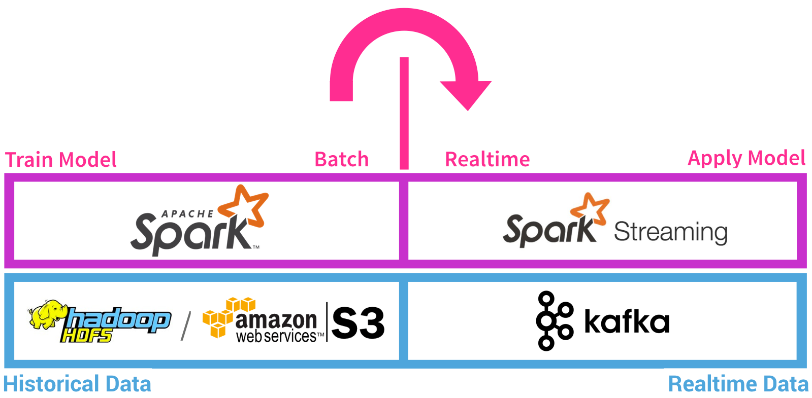

# Agile_Data_Code_2
## Introducción
El presente proyecto de la asignatura BDFI en el curso 2022-2023 tiene como finalidad implementar un sistema de predicción de retrasos de vuelos. Dicho sistema estará compuesto por una serie de componentes que se encargarán de predecir analíticamente y en tiempo real una serie de trazas para poder mostrarnos el retraso resultante. Para ello la arquitectura de nuestro sistema será la mostrada a continuación.

[](http://datasyndrome.com/video)

### Front End 
El usuario accederá a la URL donde se le presentarán los cuadros con la información relacionada con la predicción de los retrasos y formularios a rellenar. Una vez rellenado este formulario la información será enviada a la cola de mensajería en tiempo real Kafka, bajo un tópico, al servidor, donde se llevarán a cabo las labores del back-end. El último paso será el envío de esta información desde la base de datos de nuevo hacia el frontal para poder presentarla.


### Back End
Este se centrará en Spark, donde se entrenará un modelo con los datos recogidos del frontal para poder realizar las predicciones. Spark estará suscrito al tópico de Kafka para la predicción de retrasos, por lo que escuchará la cola, procesará la información del frontal y la almacenará en una base de datos Mongo.




# Proceso
A continuación, se detallará más en profundad como deberá funcionar el sistema completo:
1. Se descargarán los datos relacionados con los vuelos. Estos se encuentran en un dataset que recogerá la información suficiente como par poder predecir los retrasos y entrenar el modelo. 
2. Entrenar modelo de Machine Learning utilizando el dataset.
3. Desplegar el job de Spark que predice el retraso de los vuelos usando el modelo creado
4. Introducción de los datos del vuelo a predecir en el frontal web y su posterior envio al servidor web de Flask por medio de la cola de mensajería Kafka especificando el tópico.
5. Entrenar el modelo predictivo empleando el algoritmo RandomForest con los datos obtenidos.
6. El job de Spark en el servidor realizará la predicción de los retrasos de los vuelos por medio de los datos del tópico al que se encuentra suscrito de Kafka.
7. La ejecución del job se realizará por medio del fichero jar para Scala generado por medio de spark-submit.
8. Guardar las diversas predicciones en la base de datos de Mongo.
9. Por medio del polling que flask realizará sobre Mongo se podrá consultar los resultados de la predicción y mostrarlos en el frontal.

# Herramientas utilizadas
- [Intellij](https://www.jetbrains.com/help/idea/installation-guide.html) (jdk_1.8)
- [Pyhton3](https://realpython.com/installing-python/) (versión 3.8)
- [PIP](https://pip.pypa.io/en/stable/installing/)
- [SBT](https://www.scala-sbt.org/release/docs/Setup.html) 
- [MongoDB](https://docs.mongodb.com/manual/installation/) (versión 4.4)
- [Spark](https://spark.apache.org/docs/latest/) (versión 3.1.2)
- [Scala](https://www.scala-lang.org) (versión 2.12)
- [Zookeeper](https://zookeeper.apache.org/releases.html) (versión 3.7.1)
- [Kafka](https://kafka.apache.org/quickstart) (versión 2.12-3.0.0)
- [Flask](https://flask.palletsprojects.com/en/2.2.x/)
- [Docker](https://www.docker.com/)
- [Google-Cloud](https://cloud.google.com/)
- [AirFlow](https://airflow.apache.org/docs/apache-airflow/stable/start.html)

# Hitos realizados
* *(4 puntos)* Lograr el funcionamiento de la práctica sin realizar modificaciones
*	*(1 punto)* Ejecución del job de predicción con Spark Submit en vez de IntelliJ
*	*(1 punto)* Dockerizar cada uno de los servicios que componen la arquitectura completa
*	*(1 punto)* Desplegar el escenario completo usando docker-compose
*	*(1 punto)* Desplegar el escenario completo en Google Cloud
*	*(2 puntos)* Entrenar el modelo con Apache Airflow


## Instrucciones de despliegue

### Despliegue con Docker 
Para el despliegue de la aplicación con docker compose:

```
git clone https://github.com/rghernandez/bdfidockerized
cd bdfidockerized
docker compose up
```
Esto levantará la aplicación web en http://localhost:5000/flights/delays/predict_kafka y spark en http://localhost:8080.

### Despliegue en local

Nos descargamos el proyecto desde el github y accedemos a él:
```
git clone https://github.com/ging/practica_big_data_2019
cd practica_big_data_2019
```
Now download the data.

```
resources/download_data.sh
```

 
 ### Install python libraries
 
 ```
  pip install -r requirements.txt
 ```
 ### Start Zookeeper
 
 Open a console and go to the downloaded Kafka directory and run:
 
 ```
   bin/zookeeper-server-start.sh config/zookeeper.properties
  ```
  ### Start Kafka
  
  Open a console and go to the downloaded Kafka directory and run:
  
  ```
    bin/kafka-server-start.sh config/server.properties
   ```
   open a new console in teh same directory and create a new topic :
  ```
      bin/kafka-topics.sh \
        --create \
        --bootstrap-server localhost:9092 \
        --replication-factor 1 \
        --partitions 1 \
        --topic flight_delay_classification_request
   ```
   You should see the following message:
  ```
    Created topic "flight_delay_classification_request".
  ```
  You can see the topic we created with the list topics command:
  ```
      bin/kafka-topics.sh --bootstrap-server localhost:9092 --list
  ```
  Output:
  ```
    flight_delay_classification_request
  ```
  (Optional) You can oen a new console with a consumer in order to see the messeges sent to that topic
  ```
  bin/kafka-console-consumer.sh \
      --bootstrap-server localhost:9092 \
      --topic flight_delay_classification_request \
      --from-beginning
  ```
  ## Import the distance records to MongoDB
  Check if you have Mongo up and running:
  ```
  service mongod status
  ```
  Output:
  ```
  mongod.service - MongoDB Database Server
     Loaded: loaded (/lib/systemd/system/mongod.service; disabled; vendor preset: 
     Active: active (running) since Tue 2019-10-01 14:58:53 CEST; 2h 11min ago
       Docs: https://docs.mongodb.org/manual
   Main PID: 7816 (mongod)
     CGroup: /system.slice/mongod.service
             └─7816 /usr/bin/mongod --config /etc/mongod.conf
  
  oct 01 14:58:53 amunoz systemd[1]: Started MongoDB Database Server.
  ```
  Run the import_distances.sh script
  ```
  ./resources/import_distances.sh
  ```
  Output:
  ```
  2019-10-01T17:06:46.957+0200	connected to: mongodb://localhost/
  2019-10-01T17:06:47.035+0200	4696 document(s) imported successfully. 0 document(s) failed to import.
  MongoDB shell version v4.2.0
  connecting to: mongodb://127.0.0.1:27017/agile_data_science?compressors=disabled&gssapiServiceName=mongodb
  Implicit session: session { "id" : UUID("9bda4bb6-5727-4e91-8855-71db2b818232") }
  MongoDB server version: 4.2.0
  {
  	"createdCollectionAutomatically" : false,
  	"numIndexesBefore" : 1,
  	"numIndexesAfter" : 2,
  	"ok" : 1
  }

  ```
  ## Train and Save de the model with PySpark mllib
  In a console go to the base directory of the cloned repo, then go to the `practica_big_data_2019` directory
  ```
    cd practica_big_data_2019
  ```
  Set the `JAVA_HOME` env variable with teh path of java installation directory, for example:
  ```
    export JAVA_HOME=/usr/lib/jvm/java-1.8.0-openjdk-amd64
  ```
  Set the `SPARK_HOME` env variable with teh path of your Spark installation folder, for example:
  ```
    export SPARK_HOME=/opt/spark
  ```
  Now, execute the script `train_spark_mllib_model.py`
  ```
      python3 resources/train_spark_mllib_model.py .
  ```
  As result, some files will be saved in the `models` folder 
  
  ```
  ls ../models
  
  ```   
  ## Run Flight Predictor
  First, you need to change the base_paht val in the MakePrediction scala class,
  change that val for the path where you clone repo is placed:
  ```
    val base_path= "/home/user/Desktop/practica_big_data_2019"
    
  ``` 
  Then run the code using Intellij or spark-submit with their respective arguments. 
  
Please, note that in order to use spark-submit you first need to compile the code and build a JAR file using sbt. Also, when running the spark-submit command, you have to add at least these two packages with the --packages option:
  ```
  --packages org.mongodb.spark:mongo-spark-connector_2.12:3.0.1,org.apache.spark:spark-sql-kafka-0-10_2.12:3.1.2
     
  ``` 
   Be carefull with the packages version because if you are using another version of spark, kafka or mongo you have to choose the correspondent version to your installation. This packages work with Spark 3.1.2, kafka_2.12-3.1.2 and mongo superior to 2.6
  
  ## Start the prediction request Web Application
  
  Set the `PROJECT_HOME` env variable with teh path of you cloned repository, for example:
   ```
  export PROJECT_HOME=/home/user/Desktop/practica_big_data_2019
   ```
  Go to the `web` directory under `resources` and execute the flask web application file `predict_flask.py`:
  ```
  cd practica_big_data_2019/resources/web
  python3 predict_flask.py
  
  ```
  Now, visit http://localhost:5000/flights/delays/predict_kafka and, for fun, open the JavaScript console. Enter a nonzero departure delay, an ISO-formatted date (I used 2016-12-25, which was in the future at the time I was writing this), a valid carrier code (use AA or DL if you don’t know one), an origin and destination (my favorite is ATL → SFO), and a valid flight number (e.g., 1519), and hit Submit. Watch the debug output in the JavaScript console as the client polls for data from the response endpoint at /flights/delays/predict/classify_realtime/response/.
  
  Quickly switch windows to your Spark console. Within 10 seconds, the length we’ve configured of a minibatch, you should see something like the following:
  
  ## Check the predictions records inserted in MongoDB
  ```
   $ mongo
   > use use agile_data_science;
   >db.flight_delay_classification_response.find();
  
  ```
  You must have a similar output as:
  
  ```
  { "_id" : ObjectId("5d8dcb105e8b5622696d6f2e"), "Origin" : "ATL", "DayOfWeek" : 6, "DayOfYear" : 360, "DayOfMonth" : 25, "Dest" : "SFO", "DepDelay" : 290, "Timestamp" : ISODate("2019-09-27T08:40:48.175Z"), "FlightDate" : ISODate("2016-12-24T23:00:00Z"), "Carrier" : "AA", "UUID" : "8e90da7e-63f5-45f9-8f3d-7d948120e5a2", "Distance" : 2139, "Route" : "ATL-SFO", "Prediction" : 3 }
  { "_id" : ObjectId("5d8dcba85e8b562d1d0f9cb8"), "Origin" : "ATL", "DayOfWeek" : 6, "DayOfYear" : 360, "DayOfMonth" : 25, "Dest" : "SFO", "DepDelay" : 291, "Timestamp" : ISODate("2019-09-27T08:43:20.222Z"), "FlightDate" : ISODate("2016-12-24T23:00:00Z"), "Carrier" : "AA", "UUID" : "d3e44ea5-d42c-4874-b5f7-e8a62b006176", "Distance" : 2139, "Route" : "ATL-SFO", "Prediction" : 3 }
  { "_id" : ObjectId("5d8dcbe05e8b562d1d0f9cba"), "Origin" : "ATL", "DayOfWeek" : 6, "DayOfYear" : 360, "DayOfMonth" : 25, "Dest" : "SFO", "DepDelay" : 5, "Timestamp" : ISODate("2019-09-27T08:44:16.432Z"), "FlightDate" : ISODate("2016-12-24T23:00:00Z"), "Carrier" : "AA", "UUID" : "a153dfb1-172d-4232-819c-8f3687af8600", "Distance" : 2139, "Route" : "ATL-SFO", "Prediction" : 1 }


```

### Train the model with Apache Airflow (optional)

- The version of Apache Airflow used is the 2.1.4 and it is installed with pip. For development it uses SQLite as database but it is not recommended for production. For the laboratory SQLite is sufficient.

- Install python libraries for Apache Airflow (suggested Python 3.7)

```shell
cd resources/airflow
pip install -r requirements.txt -c constraints.txt
```
- Set the `PROJECT_HOME` env variable with the path of you cloned repository, for example:
```
export PROJECT_HOME=/home/user/Desktop/practica_big_data_2019
```
- Configure airflow environment

```shell
export AIRFLOW_HOME=~/airflow
mkdir $AIRFLOW_HOME/dags
mkdir $AIRFLOW_HOME/logs
mkdir $AIRFLOW_HOME/plugins

airflow users create \
    --username admin \
    --firstname Jack \
    --lastname  Sparrow\
    --role Admin \
    --email example@mail.org
```
- Start airflow scheduler and webserver
```shell
airflow webserver --port 8080
airflow sheduler
```
Vistit http://localhost:8080/home for the web version of Apache Airflow.

- The DAG is defined in `resources/airflow/setup.py`.
- **TODO**: add the DAG and execute it to train the model (see the official documentation of Apache Airflow to learn how to exectue and add a DAG with the airflow command).
- **TODO**: explain the architecture of apache airflow (see the official documentation of Apache Airflow).
- **TODO**: analyzing the setup.py: what happens if the task fails?, what is the peridocity of the task?


